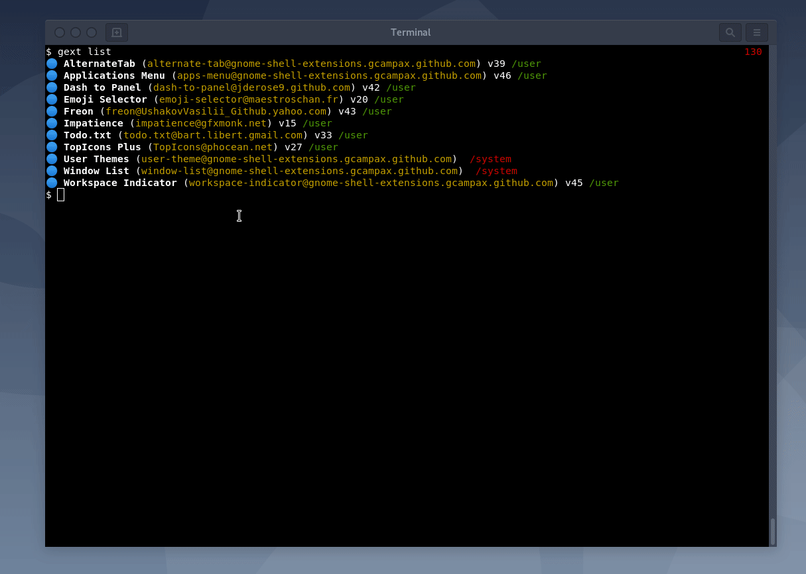
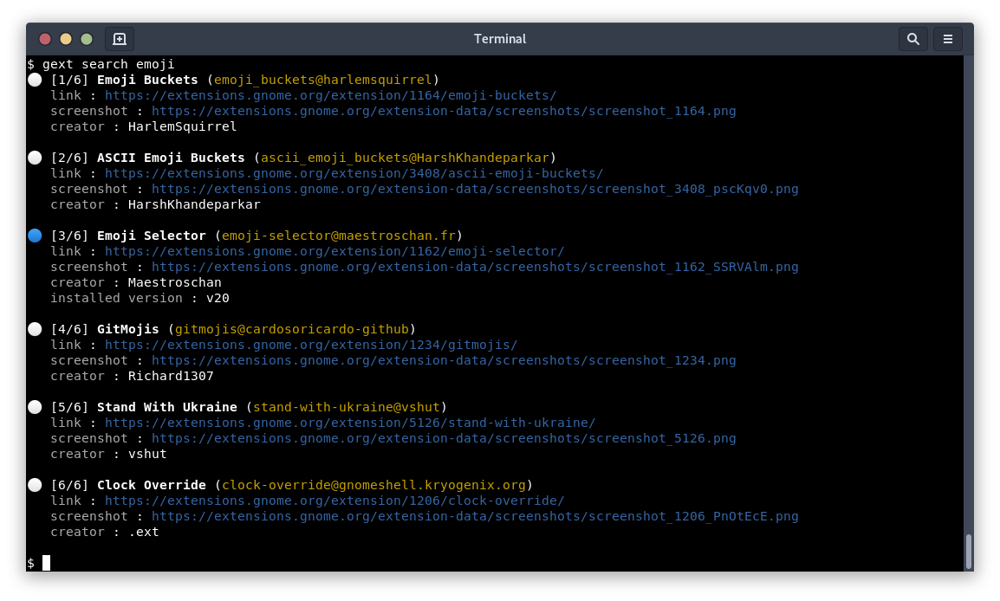
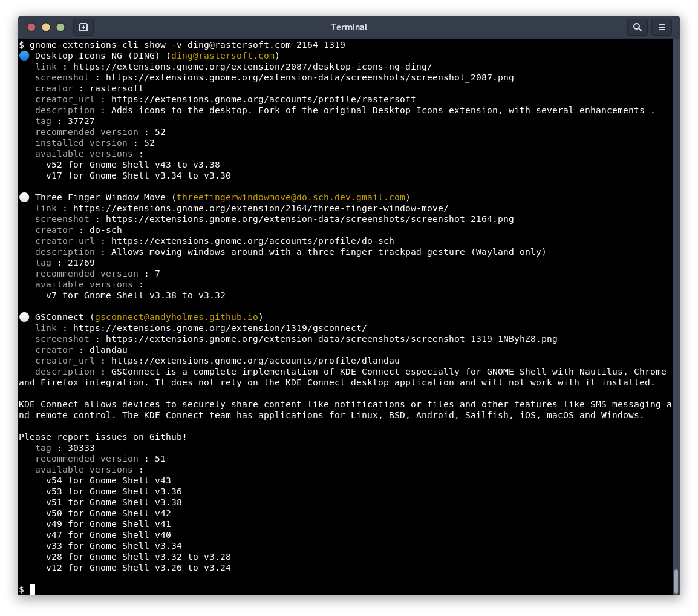

# gnome-extensions-cli

Install, update and manage your Gnome Shell extensions from your terminal !

# Features

- You can install any extension available on [Gnome website](https://extensions.gnome.org)
- Use _DBus_ to communicate with _Gnome Shell_ like the Firefox addon does
  - Also support non-DBus installations if needed
- Automatically select the compatible version to install for your Gnome Shell
- Update all your extensions with one command: `gext update`

Available commands:

- `gext list` to list you installed extensions
- `gext search` to search for extensions on [Gnome website](https://extensions.gnome.org)
- `gext install` to install extensions
- `gext update` to update any or all your extensions
- `gext uninstall` to uninstall extensions
- `gext show` to show details about extensions
- `gext enable` to enable extensions
- `gext disable` to disable extensions
- `gext preferences` to open the extension configuration window

> Note: `gext` is an alias of `gnome-extensions-cli`

# Install

## Releases

Releases are available on [PyPI](https://pypi.org/project/gnome-extensions-cli/)

> Note: [PipX](https://pypi.org/project/pipx/) is the recommended way to install 3rd-party apps in dedicated environments.

```sh
# install using pip
$ pip3 install --upgrade gnome-extensions-cli

# or using pipx (you need to install pipx first)
$ pipx install gnome-extensions-cli --system-site-packages

# gext is an alias for gnome-extensions-cli
$ gnome-extensions-cli --help
$ gext --help
```

## From the source

You can also install the _latest_ version from the Git repository:

```sh
$ pip3 install --upgrade git+https://github.com/essembeh/gnome-extensions-cli
```

You can setup a development environment with, requires [Poetry](https://python-poetry.org/)

```sh
# dependencies to install PyGObject with pip
$ sudo apt install libgirepository1.0-dev gcc libcairo2-dev pkg-config python3-dev gir1.2-gtk-3.0

# clone the repository
$ git clone https://github.com/essembeh/gnome-extensions-cli
$ cd gnome-extensions-cli

# install poetry if you don't have it yet
$ pipx install poetry

# create the venv using poetry
$ poetry install
$ poetry shell
(.venv) $ gnome-extensions-cli --help
```

# Using

## List your extensions

By default, the `list` command only display the _enabled_ extensions, using `-a|--all` argument also displays _disabled_ ones.


## Install, update or uninstall extensions

The `install` commands allows you to install extensions from their _uuid_ or _pk_.

> Note: You can use `search` command to find extensions, `gext` prints _uuids_ in _yellow_ .

```sh
# Install extension by its UUID
$ gext install dash-to-panel@jderose9.github.com

# or use its package number from https://extensions.gnome.org
$ gext install 1160

# You can also install multiple extensions at once
$ gext install 1160 todo.txt@bart.libert.gmail.com

# Uninstall extensions
$ gext uninstall todo.txt@bart.libert.gmail.com

# You can enable and disable extensions
$ gext enable todo.txt@bart.libert.gmail.com
$ gext disable todo.txt@bart.libert.gmail.com dash-to-panel@jderose9.github.com
```


The `update` command without arguments updates all _enabled_ extensions.
You can also `update` a specific extension by giving its _uuid_.



> Note: the `--install` argument allow you to _install_ extensions given to `update` command if they are not installed.

## Search for extensions and show details

The `search` command searches from [Gnome website](https://extensions.gnome.org) and prints results in your terminal:



The `show` command fetches details from _Gnome website_ and prints them:



# Under the hood: DBus vs Filesystem

`gext` can interact with Gnome Shell using two different implementations, using `dbus` or using a `filesystem` operations.

> Note: By default, it uses `dbus` (as it is the official way), but switches to `filesystem` if `dbus` is not available (like with _ssh_ sessions)

## DBus

Using `--dbus`, the application uses _dbus_ messages with DBus Python API to communicate with Gnome Shell directly.

Installations are interactive, like when you install extensions from your browser on Gnome website, you are prompted with a Gnome _Yes/No_ dialog before installing the extensions

Pros:

- You are using the exact same way to install extensions as the Firefox addon
- Automatically restart the Gnome Shell when needed
- Very stable
- You can open the extension preference dialog with `gext edit EXTENSION_UUID`

Cons:

- You need to have a running Gnome session

## Filesystem backend

Using `--filesystem`, the application uses unzip packages from [Gnome website](https://extensions.gnome.org) directly in you `~/.local/share/gnome-shell/extensions/` folder, enable/disable them and restarting the Gnome Shell using subprocesses.

Pros:

- You can install extensions without any Gnome session running (using _ssh_ for example)
- Many `gext` alternatives CLI tools use this method

Cons:

- Some extensions might not install well
